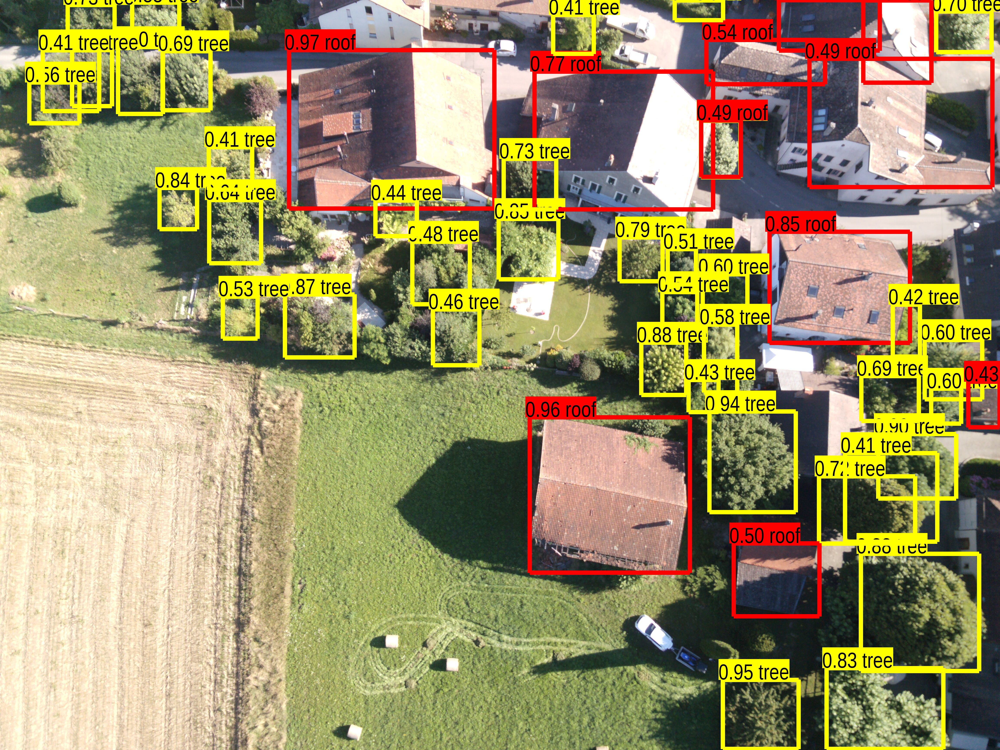

# Entry-level-test-project for robotic engineer

## Description

Implement an object detectior or a segmentation deep learning algorithm which can detect roofs and trees.

1. Create a cutom dataset by annotating images from [Sensfly Crop Field (RGB) dataset](https://www.sensefly.com/education/datasets/?dataset=1502&industries%5B%5D=2)
2. Train object on your dataset
3. Predict, and show results
4. Document code

## Useful links:

1. [Annotation Best Practices for Object Detection](https://nanonets.github.io/tutorials-page/docs/annotate)

2. [Google Colab](https://colab.research.google.com/notebooks/intro.ipynb#recent=true)

3. [Tensorflow detection model zoo](https://github.com/tensorflow/models/blob/master/research/object_detection/g3doc/detection_model_zoo.md)

   

